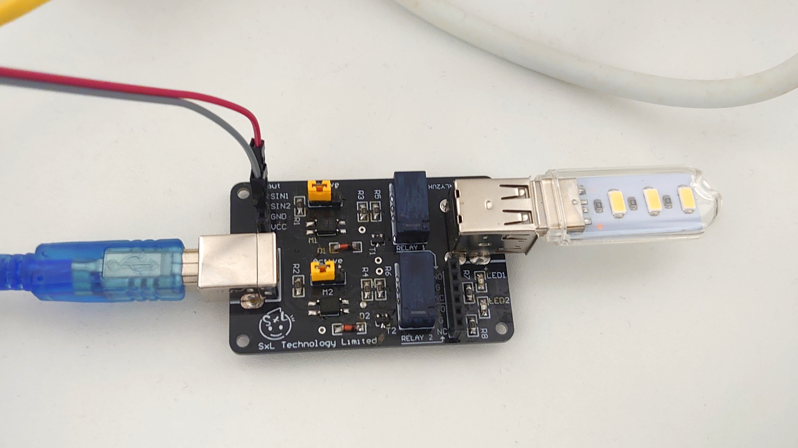

# SxL RLY2UH Sample Control Script
Control SxL RLY2UH relay module from Raspberry Pi

The script is to be run on Raspberry Pi!

Change the variables `relay1_pin` and `relay2_pin` to the pin number connected to SIN1 and SIN2 of the relay module respectivity.

## Example commands

Turn relay 1 on:

`RLY2UH_control.py -r 1 on`

Turn relay 2 off:

`RLY2UH_control.py -r 2 off`

Turn off relay 2 after 30 seconds:

`RLY2UH_control.py -r 2 -t 30 off`

## HTTP Server

A simple HTTP server is provided to allow control through LAN/Internet.

Start the server:

```
export FLASK_APP=RLY2UH_http_control.py
cd <path_to_source>
flask run

# If want to expose to the whole network: (do it at your own risk)
flask run --host=0.0.0.0
```

GET arguments:
- relay=[1|2]
- action=[on|off|toggle]

Example URL:

`http://127.0.0.1:5000/relay_control?relay=2&action=toggle`

## Demo



Remote control an USB lamp via SSH on mobile phone: https://www.youtube.com/watch?v=FLi56sj9ToY

Remote control through a smartwatch sending HTTP command: https://youtube.com/shorts/5wBk7VCaKU0

## Purchase

SxL RLY2UH is a USB relay module with USB power input/output, super simple wiring and it can be controlled by simple GPIO signal. You may visit [this website](https://sxltech.com/productD?product=3c7b4a67-27f6-11eb-b836-06017535b818) to order.
